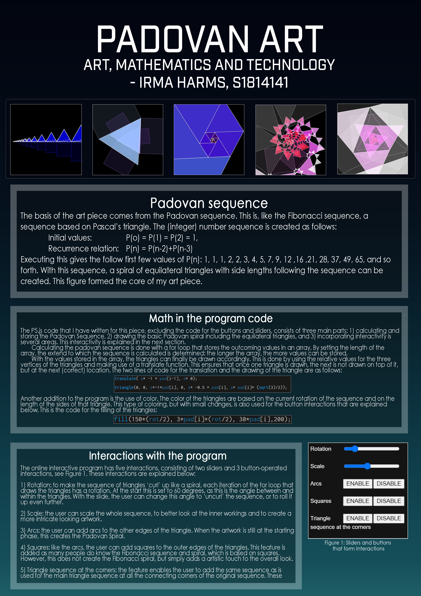

## Irma Harms' Master Piece for AMT

On this page you will find my Master Piece for the course Art, Mathematics and Technology at the University of Twente. It includes the art piece itself and a poster explaining the math behind it. 

### Padovan Inspired Art Piece
The piece can be viewed on [this page](https://irmaaa97.github.io/AMT-Master-Piece/Padovan/)

### Poster

